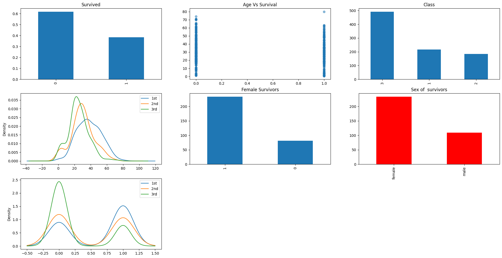

# Predicting Titanic Survivors

## 1. Problem Statement

The objective is to develop a machine learning model that accurately predicts the survival status of passengers aboard the Titanic. This involves analyzing the dataset containing information about passengers and their survival outcome, and then training a model to make predictions based on relevant features.

    

## 2. Dataset

The data has been split into two groups:

- training set (train.csv)
- test set (test.csv)

The training set should be used to build your machine learning models. For the training set, we provide the outcome (also known as the “ground truth”) for each passenger. Your model will be based on “features” like passengers’ gender and class. You can also use feature engineering to create new features.

The test set should be used to see how well your model performs on unseen data. For the test set, we do not provide the ground truth for each passenger. It is your job to predict these outcomes. For each passenger in the test set, use the model you trained to predict whether or not they survived the sinking of the Titanic.

We also include gender_submission.csv, a set of predictions that assume all and only female passengers survive, as an example of what a submission file should look like.

## Data Dictionary
| Variable | Definition                 | Key                                      |
|----------|----------------------------|------------------------------------------|
| survival | Survival                   | 0 = No, 1 = Yes                          |
| pclass   | Ticket class               | 1 = 1st, 2 = 2nd, 3 = 3rd                |
| sex      | Sex                        |                                          |
| Age      | Age in years               |                                          |
| sibsp    | # of siblings / spouses   |                                          |
|          | aboard the Titanic         |                                          |
| parch    | # of parents / children   |                                          |
|          | aboard the Titanic         |                                          |
| ticket   | Ticket number              |                                          |
| fare     | Passenger fare             |                                          |
| cabin    | Cabin number               |                                          |
| embarked | Port of Embarkation        | C = Cherbourg, Q = Queenstown, S = Southampton |

## 3. Exploratory Data Analysis (EDA)

The EDA phase involves:
- Data visualization: plotting relationships between target class and predictor variables, exploring distributions of features, etc.
- Data profiling: generating a profiling report to understand the dataset's structure, summary statistics, missing values, etc.

    

## 4. Data Preprocessing

This phase includes:
- Handling missing values: imputing null values for certain features like Age, Fare, Embarked, etc.
- Feature engineering: creating new features like Deck, Title, Age groups, Fare groups, etc.
- Label encoding: converting categorical features into numerical representations using label encoding.
- Creating additional features: like 'isAlone' to indicate if a passenger is traveling alone, 'classAge' by multiplying Pclass and Age, etc.

## 5. Feature Selection

Utilizing ensemble methods to identify the most important features for survival prediction. This involves using algorithms such as Random Forest, Extra Trees, AdaBoost, and Gradient Boosting to evaluate feature importances.

## 6. Model Training and Prediction

Building predictive models using different algorithms such as Random Forest, XGBoost, etc. The model is trained on the training dataset and evaluated using cross-validation techniques. Finally, the trained model is used to make predictions on the test dataset.

## 7. Model Evaluation

The performance of the model is evaluated using metrics such as accuracy, precision, recall, F1-score, etc. Cross-validation techniques are used to ensure robustness and generalization of the model.

## 8. Result

The final output is a CSV file containing predictions for whether each passenger survived or not. These predictions are submitted as the solution to the problem statement.

## 9. Dependencies

- Python libraries: NumPy, Pandas, Matplotlib, Seaborn, Scikit-learn, XGBoost.
- Other packages: ydata-profiling (for data profiling).

## 10. Files

- Titanic_Survivors.ipynb: Jupyter Notebook containing the entire code implementation.
- train.csv: Training dataset containing passenger information.
- test.csv: Test dataset for making predictions.
- preprocessed_train.csv: Preprocessed training dataset.
- preprocessed_test.csv: Preprocessed test dataset.
- results.csv: CSV file containing the predictions generated by the model.

## 11. Usage

- Clone the repository and ensure all dependencies are installed.
- Run Titanic_Survivors.ipynb in a Jupyter Notebook environment or any compatible platform.
- Follow the instructions and execute the code cells to perform data preprocessing, model training, and prediction.
- Access the results.csv file to view the predictions made by the model.

## 12. Author

[vineet kukreti]

## 13. License

This project is licensed under the [MIT License](https://opensource.org/licenses/MIT).
